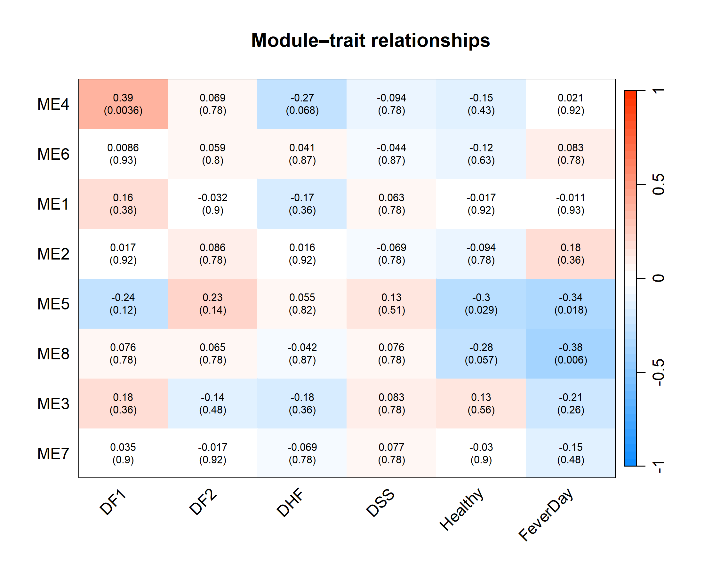
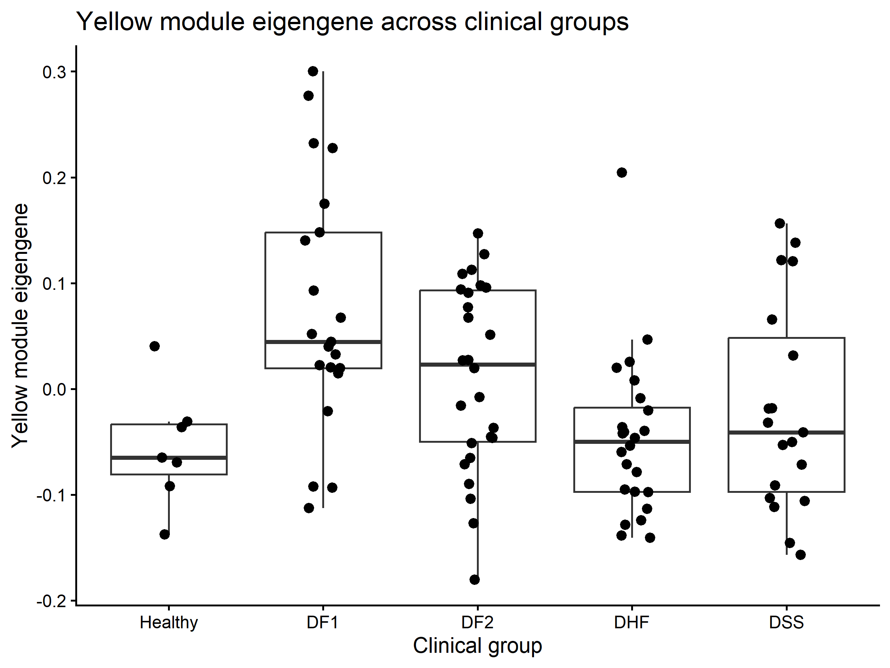
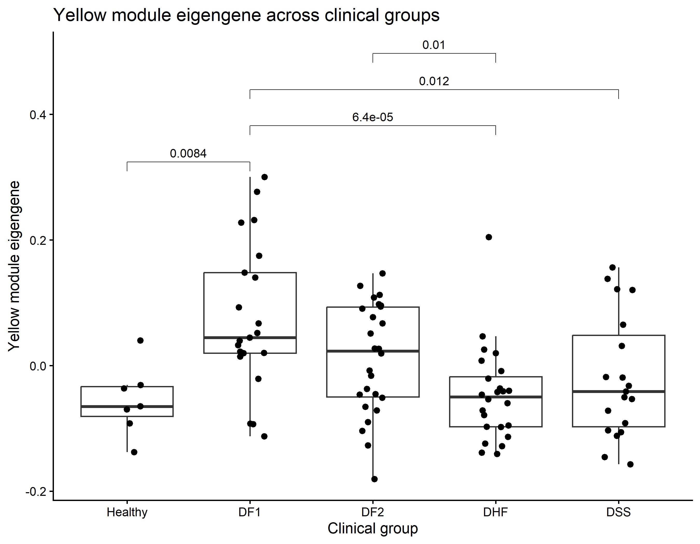
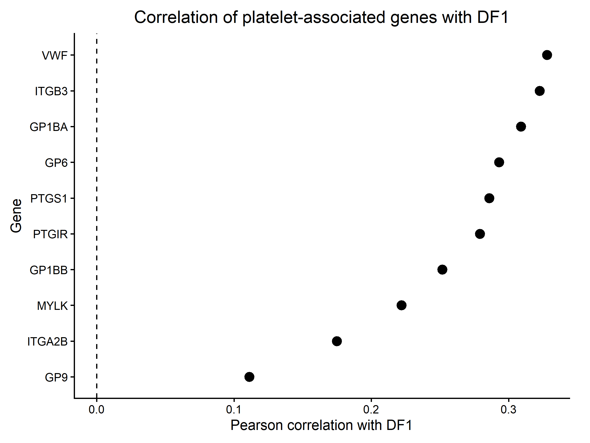
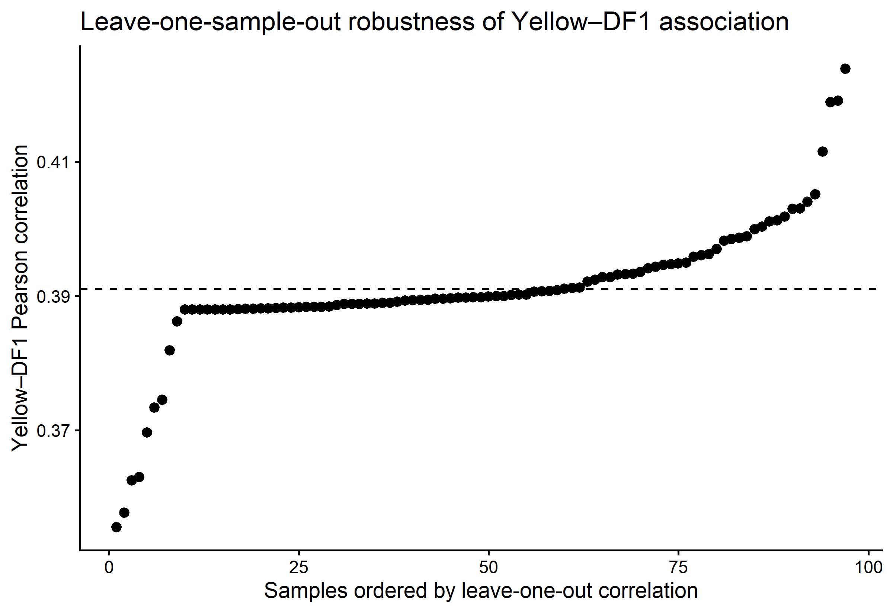
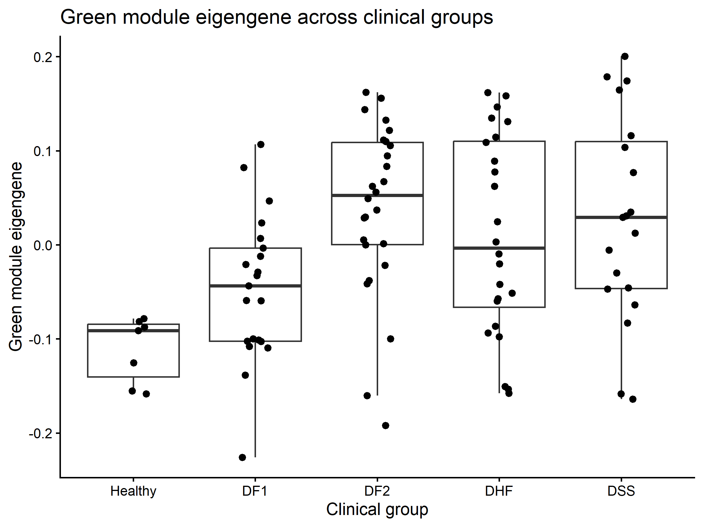
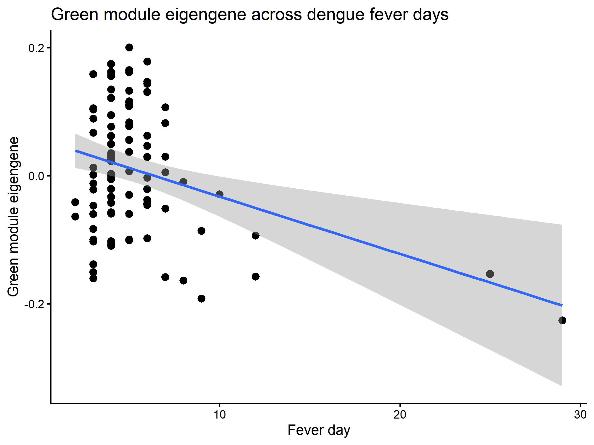
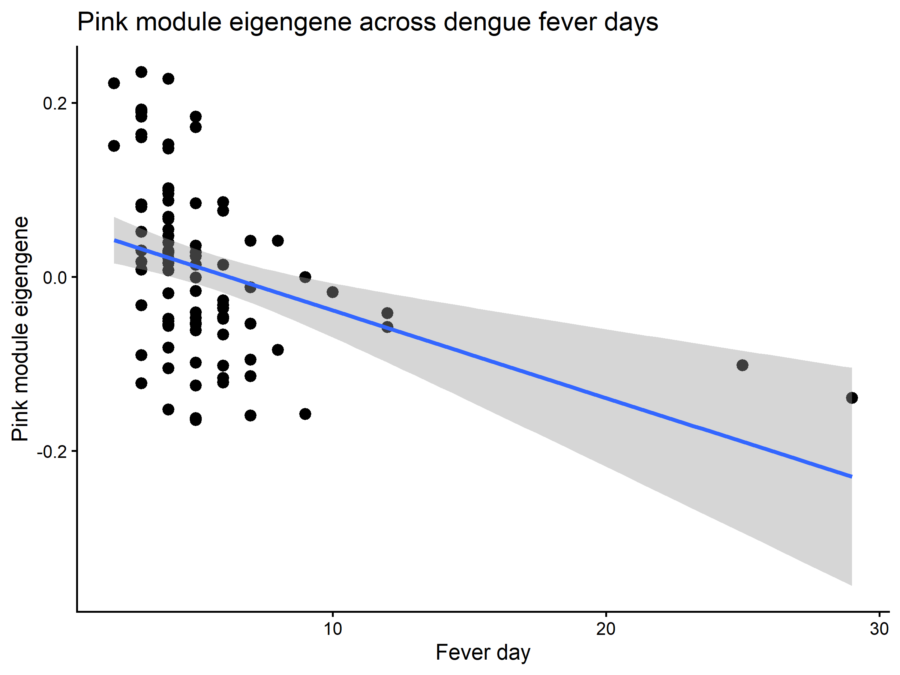

# WGCNA Analysis of Dengue Infection in Pediatric PBMCs (GSE38246)

Weighted Gene Co-expression Network Analysis (WGCNA) of peripheral blood
mononuclear cell (PBMC) transcriptomes from Nicaraguan children with dengue
infection, using the public dataset **[GSE38246](https://www.ncbi.nlm.nih.gov/geo/query/acc.cgi?acc=GSE38246)**.

This repository contains a single, complete, reproducible R script that takes
the raw GEO series matrix all the way through quality control, network
construction, module–trait association, hub-gene identification, and
functional enrichment — with every methodological decision documented and
justified in-line.

> **Repo:** https://github.com/mohdkhubaib-qubit/GSE38246-WGCNA-Dengue

---

## Table of contents

- [Background](#background)
- [Dataset](#dataset)
- [Objectives](#objectives)
- [Repository structure](#repository-structure)
- [Pipeline overview](#pipeline-overview)
- [How to run](#how-to-run)
- [Results](#results)
  - [Module–trait relationships](#module–trait-relationships)
  - [Yellow module (platelet / coagulation, DF1)](#yellow-module-platelet--coagulation-df1)
  - [Green module (cell-cycle, fever day)](#green-module-cell-cycle-fever-day)
  - [Pink module (antiviral / innate immune, fever day)](#pink-module-antiviral--innate-immune-fever-day)
- [Key findings summary](#key-findings-summary)
- [Limitations & caveats](#limitations--caveats)
- [License](#license)

---

## Background

Dengue virus infection produces a spectrum of clinical outcomes, from mild
primary fever (DF1/DF2) to severe, potentially life-threatening
complications — Dengue Hemorrhagic Fever (DHF) and Dengue Shock Syndrome
(DSS). PBMCs (the blood's immune cell fraction) mount a coordinated
transcriptional response to infection, and that response changes both with
**disease severity** and with **time since fever onset**.

Rather than looking gene-by-gene (which produces thousands of individually
weak, hard-to-interpret hits), **WGCNA** groups genes into modules of
co-expressed genes — genes that rise and fall together across samples. Each
module is then reduced to a single summary value per sample (its
*eigengene*), which can be tested against clinical variables far more
powerfully than testing every gene individually. Modules that come out
significant can then be interrogated for their biological identity (via
pathway enrichment) and their most "central" genes (via hub-gene analysis).

## Dataset

| | |
|---|---|
| **GEO accession** | GSE38246 |
| **Title** | Transcriptional response to dengue infection in PBMCs of Nicaraguan children |
| **Organism** | *Homo sapiens* |
| **Platform** | GPL15615 |
| **Samples** | 105 dengue-infected PBMC samples (DF1, DF2, DHF, DSS) + 8 healthy controls |
| **Clinical info** | Encoded directly in GEO sample titles, e.g. `"63.3 DF1 D6"` = patient 63.3, primary dengue fever, fever day 6 |

## Objectives

1. Build gene co-expression modules from PBMC expression profiles.
2. Relate modules to dengue clinical category (DF1 / DF2 / DHF / DSS /
   Healthy) and fever day.
3. Identify biologically meaningful modules and candidate hub genes.
4. Run GO Biological Process and KEGG functional enrichment on the
   clinically-relevant modules.
5. Assess the robustness of the strongest module–trait association.

## Repository structure

```
.
├── scripts/
│   └── GSE38246_WGCNA_Final_Script.R      # complete, reproducible analysis (31 sections)
├── results/
│   ├── figures/
│   │   ├── FINAL_Module_Trait_Heatmap.png
│   │   ├── Module_Trait_Heatmap.png
│   │   ├── Yellow_Module_Clinical_Groups.png
│   │   ├── Yellow_Module_Clinical_Groups_Significance.png
│   │   ├── Yellow_DF1_LOO_Robustness.png
│   │   ├── Platelet_Genes_DF1_Correlation.png
│   │   ├── Green_Module_Clinical_Groups.png
│   │   ├── Green_Module_FeverDay.png
│   │   └── Pink_Module_FeverDay.png
│   └── tables/
│       ├── WGCNA_Module_Sizes.csv
│       ├── Module_Trait_Correlations.csv
│       ├── Module_Trait_FDR.csv
│       ├── Yellow_Module_Genes.csv
│       ├── Green_Module_Genes.csv
│       ├── Pink_Module_Genes.csv
│       ├── Pink_Antiviral_Genes.csv
│       └── Yellow_DF1_LOO_Robustness.csv
├── README.md
├── LICENSE
└── .gitignore
```

## Pipeline overview

| Stage | What happens | Key numbers |
|---|---|---|
| Import | Parse GEO series matrix | 45,696 probes × 113 samples |
| Sample QC | Remove samples with >30% missing values | 10 samples removed → 103 remain |
| Probe QC | Remove probes with >20% missing values | 35,088 probes retained |
| Annotation | Map probes → gene symbols via GPL15615 | 32,330 annotated probes |
| Collapse multi-probe genes | Keep highest-SD probe per gene | 21,488 unique genes |
| Sample outlier removal | Remove samples with mean correlation < 0.45 | 6 samples removed → 97 remain |
| Feature selection | Keep top 8,000 most variable genes, impute remaining NAs (KNN) | 97 × 7,915, zero missing |
| Soft-thresholding | `pickSoftThreshold()`, signed network, `bicor` | power = 12 (chosen pragmatically) |
| Network construction | `blockwiseModules()`, signed, bicor, minModuleSize = 30 | 8 modules + grey |
| Module–trait correlation | Pearson r + BH-FDR across 48 tests | see [Results](#module–trait-relationships) |
| Hub genes | `|kME| ≥ 0.80`, `|GS| ≥ 0.20`, genome-wide FDR < 0.05 | 4 candidates (Yellow/DF1) |
| Enrichment | `enrichGO()` (BP) + `enrichKEGG()` | see script Sections 21–23 |

Full methodological reasoning — including a deliberately preserved
gene-gene-vs-sample-sample correlation debugging note, and the justification
for overriding the "pick the power with the highest R²" rule of thumb — is
documented inline in `scripts/GSE38246_WGCNA_Final_Script.R`.

## How to run

1. Download the GEO series matrix file for GSE38246
   (`GSE38246_series_matrix.txt`). The GPL15615 platform annotation table is
   fetched automatically inside the script via `GEOquery::getGEO()`.
2. Edit the `setwd()` call at the top of
   `scripts/GSE38246_WGCNA_Final_Script.R` to point at the folder containing
   the series matrix file.
3. Run the script top to bottom in R / RStudio. Required packages (WGCNA,
   GEOquery, clusterProfiler, org.Hs.eg.db, enrichplot, ggplot2, ggpubr,
   pheatmap) are installed automatically if missing.
4. All figures and tables are written to the working directory — move them
   into `results/figures/` and `results/tables/` as done here.

---

## Results

### Module–trait relationships

The core result of the whole analysis: correlating all 8 module eigengenes
against 6 clinical traits (5 disease indicators + fever day) gives 48 tests;
after joint Benjamini–Hochberg FDR correction, only **4 cells are
significant**.



*(An earlier-formatting render of the same underlying correlation/FDR
values is also included as [`Module_Trait_Heatmap.png`](results/figures/Module_Trait_Heatmap.png).)*

| Module | Trait | r | FDR |
|---|---|---|---|
| Yellow (ME4) | DF1 | 0.391 | 0.0036 |
| Green (ME5) | FeverDay | −0.338 | 0.0179 |
| Green (ME5) | Healthy | −0.305 | 0.0287 |
| Pink (ME8) | FeverDay | −0.377 | 0.0060 |

Every DF2 / DHF / DSS correlation, for every module, drops out after
correction — a key finding in itself: these modules track **primary
infection stage** and **illness duration**, not disease severity category
per se. Full numeric values: [`Module_Trait_Correlations.csv`](results/tables/Module_Trait_Correlations.csv),
[`Module_Trait_FDR.csv`](results/tables/Module_Trait_FDR.csv). Module sizes:
[`WGCNA_Module_Sizes.csv`](results/tables/WGCNA_Module_Sizes.csv).

---

### Yellow module (platelet / coagulation, DF1)

127 genes ([`Yellow_Module_Genes.csv`](results/tables/Yellow_Module_Genes.csv)).
GO/KEGG enrichment: **platelet activation, blood coagulation, hemostasis,
wound healing** — KEGG's top hit is *Platelet activation* itself
(p.adjust ≈ 3.4×10⁻⁵). Candidate hub genes for DF1 (strict criteria:
`|kME| ≥ 0.80`, `|GS| ≥ 0.20`, genome-wide FDR < 0.05): `HIST1H2BN`,
`HIST1H2AE`, `HIST1H2BJ`, `TNNC2`.

<p float="left">
  
  
</p>

DF1 is clearly the highest group for the Yellow eigengene (left), and this
is statistically confirmed by pairwise Wilcoxon tests (right): DF1 is
significantly different from DHF (p = 6.4×10⁻⁵) and DSS (p = 0.01) — i.e.
the platelet/coagulation program is specifically elevated in **early,
primary infection** rather than in the more severe clinical categories.



All 10 curated platelet-associated genes (VWF, ITGB3, GP1BA, GP6, PTGS1,
GP1BB, PTGIR, MYLK, ITGA2B, GP9) show **positive** correlation with DF1
(range 0.11–0.33) — no single standout gene, but a clear, coordinated
module-level signal consistent with dengue-associated platelet
consumption/activation.



To check the Yellow–DF1 association isn't driven by one or two unusual
patients, the correlation was recomputed 97 times, each time dropping one
sample. Every value stays tightly clustered around the full-sample result
(dashed line, r = 0.391; range 0.356–0.424 — see
[`Yellow_DF1_LOO_Robustness.csv`](results/tables/Yellow_DF1_LOO_Robustness.csv)),
confirming the association is stable across the cohort.

---

### Green module (cell-cycle, fever day)

89 genes ([`Green_Module_Genes.csv`](results/tables/Green_Module_Genes.csv)).
GO/KEGG enrichment: **mitotic / chromosome-segregation processes** (sister
chromatid segregation, mitotic nuclear division, chromosome localization),
plus KEGG hits for *p53 signaling* and *protein processing in the ER* —
consistent with a cell-cycle / proliferation module, likely reflecting
expansion of activated immune-cell populations during acute infection.



Healthy sits lowest, DF2 highest, DHF/DSS intermediate — a proliferative
response that ramps up with infection but plateaus rather than tracking
severity linearly.



A clear downward trend (r = −0.338, FDR = 0.0179): the proliferative signal
is strongest early in illness and fades as fever day increases.

---

### Pink module (antiviral / innate immune, fever day)

36 genes ([`Pink_Module_Genes.csv`](results/tables/Pink_Module_Genes.csv)).
GO/KEGG enrichment: **viral life cycle, antiviral innate immune response,
response to cytokine/virus** — a textbook interferon-stimulated gene (ISG)
signature. A curated antiviral gene panel (ETV7, XAF1, IFIT1, RSAD2, LAMP3,
IFIT2, SIGLEC1, CXCL10, CCL2, OAS1) is detailed in
[`Pink_Antiviral_Genes.csv`](results/tables/Pink_Antiviral_Genes.csv) —
only `ETV7` and `XAF1` reach genome-wide FDR < 0.05 for fever day, and
neither individually satisfies the strict `|kME| ≥ 0.80` hub criterion.

> ⚠️ KEGG hits for *Hepatitis C* and *Influenza A* in this module are **not**
> evidence of co-infection — these are generic shared host antiviral
> pathway gene sets (IFIT1, CXCL10, RSAD2, OAS1) that appear across many
> viral-response KEGG pathways regardless of the actual pathogen.



A clear downward trend (r = −0.377, FDR = 0.0060) — the antiviral signature
is strongest early in illness and fades as fever day increases, consistent
with the expected kinetics of an acute innate antiviral response that peaks
early post-infection and wanes.

---

## Key findings summary

| Module | Color | Genes | Associated with | Biological identity |
|---|---|---|---|---|
| ME4 | 🟡 Yellow | 127 | DF1 (r = 0.39, FDR = 0.0036) | Platelet activation / coagulation |
| ME5 | 🟢 Green | 89 | FeverDay (r = −0.34), Healthy (r = −0.30) | Mitotic / cell-cycle |
| ME8 | 🩷 Pink | 36 | FeverDay (r = −0.38, FDR = 0.0060) | Antiviral / innate immune (ISGs) |

- **Candidate hub genes** (strict criteria), Yellow/DF1 only: `HIST1H2BN`,
  `HIST1H2AE`, `HIST1H2BJ`, `TNNC2`. No genes passed the strict criteria for
  Green/FeverDay or Pink/FeverDay, even though both modules are significant
  at the eigengene level.
- **Module–module relationships:** Yellow–Pink positively correlated
  (r = 0.41, despite **zero shared genes** — modules are disjoint by
  construction); Yellow–Green negatively correlated (r = −0.37); Green–Pink
  not significantly correlated (r = 0.05).
- **Overall narrative:** dengue infection triggers (1) an early, broad
  antiviral/interferon response (Pink) that fades with time since fever
  onset; (2) a proliferative immune-cell-expansion response (Green) with a
  similar early-peak pattern; and (3) a platelet/coagulation program
  (Yellow) specifically elevated in primary early infection (DF1) relative
  to the more severe categories (DHF/DSS). The three programs are only
  loosely coupled to each other, suggesting partly independent biological
  processes running in parallel rather than one unified "severity axis."

## Limitations & caveats

- Soft-thresholding power 12 was chosen **pragmatically** (higher powers
  gave higher R² but produced unusably sparse networks), not because it
  maximized scale-free topology fit.
- Restricting to the top 8,000 most variable genes was a pragmatic
  dimensionality-reduction choice, not a data-driven optimum.
- The sample-outlier cutoff (mean correlation < 0.45, six samples removed)
  was a pragmatic decision; a formal sensitivity analysis of this threshold
  was not performed. The leave-one-out robustness check assesses stability
  *conditional on* this prior removal — it does not independently validate
  the removal decision itself.
- The Healthy control group is small (n = 7), limiting statistical power
  for any Healthy-involving comparison.
- FeverDay analyses use dengue samples only (n = 90); the five disease
  binary indicators are mutually exclusive and compositional.
- Module–trait and module–module correlation do **not** imply causality.
- Hub-gene thresholds are operational, pre-specified criteria for this
  analysis — not a universal definition of "hub gene."
- Pink module KEGG hits for *Hepatitis C* / *Influenza A* reflect shared
  host antiviral gene sets and are **not** evidence of co-infection.
- Platelet genes in Yellow show a coherent module/pathway-level signal
  without any single gene individually passing genome-wide FDR — module-
  level and gene-level significance are distinct claims and should not be
  conflated.

Full detail on every caveat above is documented in the **Limitations /
Interpretation Caveats** section at the end of
`scripts/GSE38246_WGCNA_Final_Script.R`.

## License

MIT — see [LICENSE](LICENSE).
